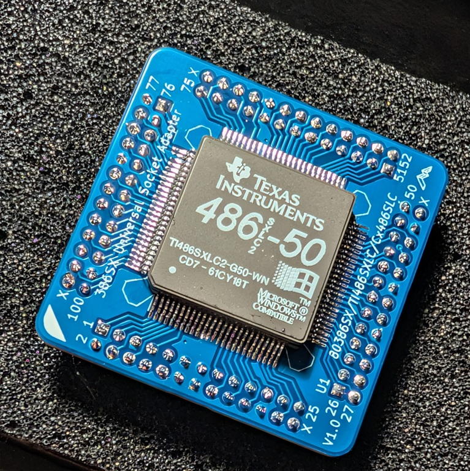

# i386sx-socket
386SX Universal Socket Adapter for the [Alsea River 386SX Motherboard](https://github.com/skiselev/mb386sx-rc2016)

## Hardware Documentation

### Schematic and PCB Layout

* [Schematic - Version 1.0](KiCad/i386sx-socket-Schematic-1.0.pdf)
* [PCB Layout - Version 1.0](KiCad/i386sx-socket-Board-1.0.pdf)

### Jumpers

#### JP1, JP2 - Bypass the 3.3V Voltage Regulator

Position         | Description
-----------------|--------------------------------------------------------------------------------------------------
Closed (default) | 5V CPU: 5V from the socket is connected to the CPU VCC pins, bypassing the 3.3V voltage regulator
Open             | 3.3V CPU: CPU VCC pins are connected to the 3.3V voltage regulator

#### JP3 - Connect Pin 45 to VCC

Position         | Description
-----------------|--------------------------------------------------------------------------------------------------
1-2              | 5V CPU: Socket pin 45 is connected to the CPU pin 45
Open             | 3.3V CPU: CPU pin 45 is connected to 5V (VCC5 for the 3.3V CPUs)

### Bill of Materials

#### Version 1.0

[386SX Universal Socket Adapter project on Mouser.com](https://www.mouser.com/Tools/Project/Share?AccessID=3e806c1828) - View and order most components except of the CPU, and the PCB.

Component type     | Reference | Description                                          | Quantity | Possible sources and notes 
------------------ | --------- | ---------------------------------------------------- | -------- | --------------------------
PCB                |           | 386SX Universal Socket PCB - Version 1.0             | 1        | Order from a PCB manufacturer of your choice using provided Gerber or KiCad files
Integrated Circuit | U1        | 386SX CPU, TI486SXLC, Cx486SLC CPU, 100 pin BQFP     | 1        | eBay
Integrated Circuit | U2        | NCP1117-3.3, 3.3 V LDO voltge regulator, TO-252-3    | 1        | Mouser [863-NCP1117DT33T5G](https://www.mouser.com/ProductDetail/863-NCP1117DT33T5G). Optional - required for 3.3V CPU
Capacitor          | C1 - C3   | 100 nF, MLCC, 0603 SMD                               | 3        | Mouser [581-KGM15BR71H104JM](https://www.mouser.com/ProductDetail/581-KGM15BR71H104JM). C3 is optional - required for 3.3V CPU
Capacitor          | C4, C5    | 10 uF, MLCC or Tantalum, 1206 SMD                    | 2        | Mouser [963-TMK316BJ106KL-T](https://www.mouser.com/ProductDetail/963-TMK316BJ106KL-T), [74-T55A106M6R3C0200](https://www.mouser.com/ProductDetail/74-T55A106M6R3C0200). Optional - required for 3.3V CPU
Connector          | J1 - J4   | 2x13 pin header, 2 mm pitch                          | 4        | Mouser [538-87758-2616](https://www.mouser.com/ProductDetail/538-87758-2616), [200-MTMM11305LD190](https://www.mouser.com/ProductDetail/200-MTMM11305LD190)
